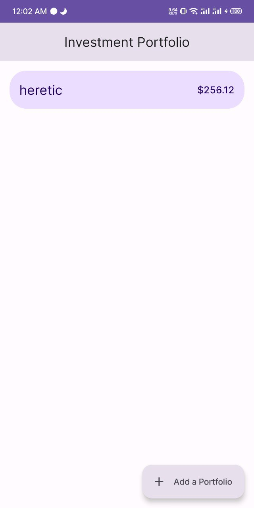
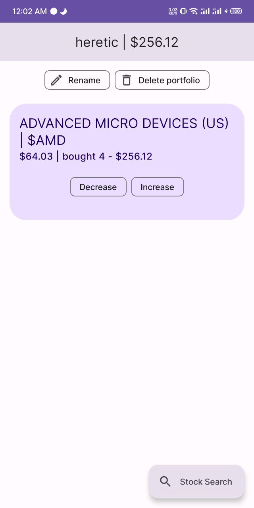
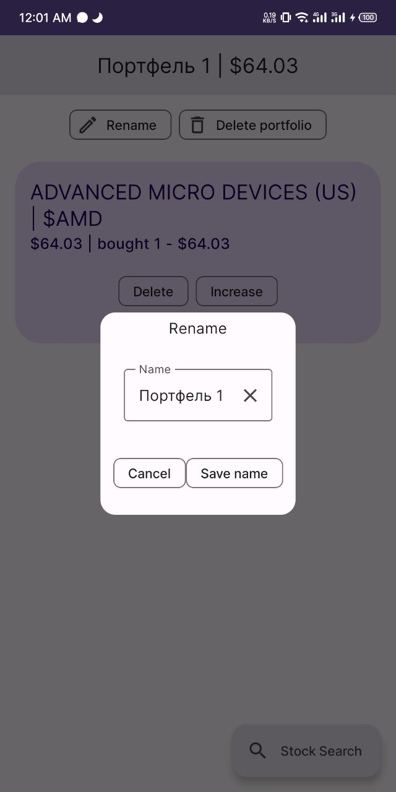

# Инвестиционный портфель (Android/Kotlin, курсовая 4-ого семестра не для себя)

Программа предоставляет возможность создавать портфели и добавлять в них акции. Использует Jetpack Compose (Material You), БД Room, API Finnhub (ключ не затирал для гитхаба, приложение можно собрать с ним), языки Ru/En, вроде как должна работать автосинхронизация при изменении котировок.

Написано за 7 дней. Содержит баги, написано без архитектурных знаний платформы и Compose'а.

