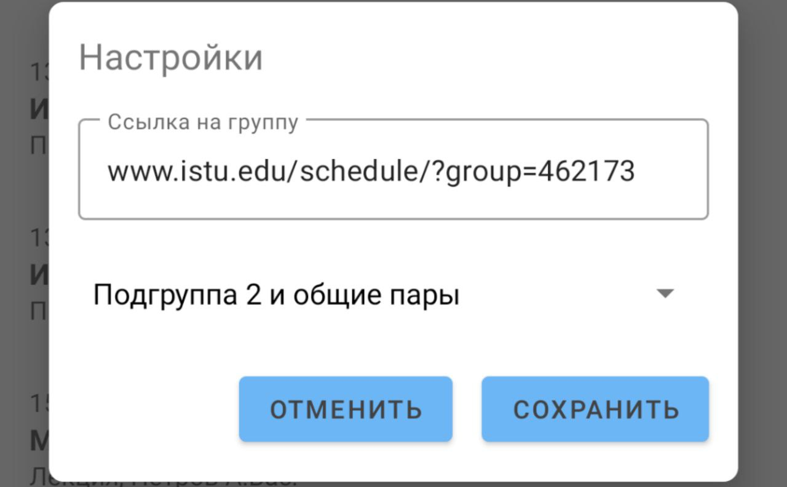

# Расписание ИРНИТУ (Android/Kotlin, курсовая 4-ого семестра для себя)

Программа предоставляет возможность просматривать расписание группы Иркутского Политеха, выбирать подгруппу, автоматически добавляет расписание в системный календарь для синхронизации с умными устройствами. Использует БД Room, Jetpack Datastore, парсит сайт при помощи jsoup, языки Ru/En, автосинхронизация каждые 12 часов.

Написано за 1.5 месяца, первый опыт с Android. Написано без архитектурных знаний платформы.

