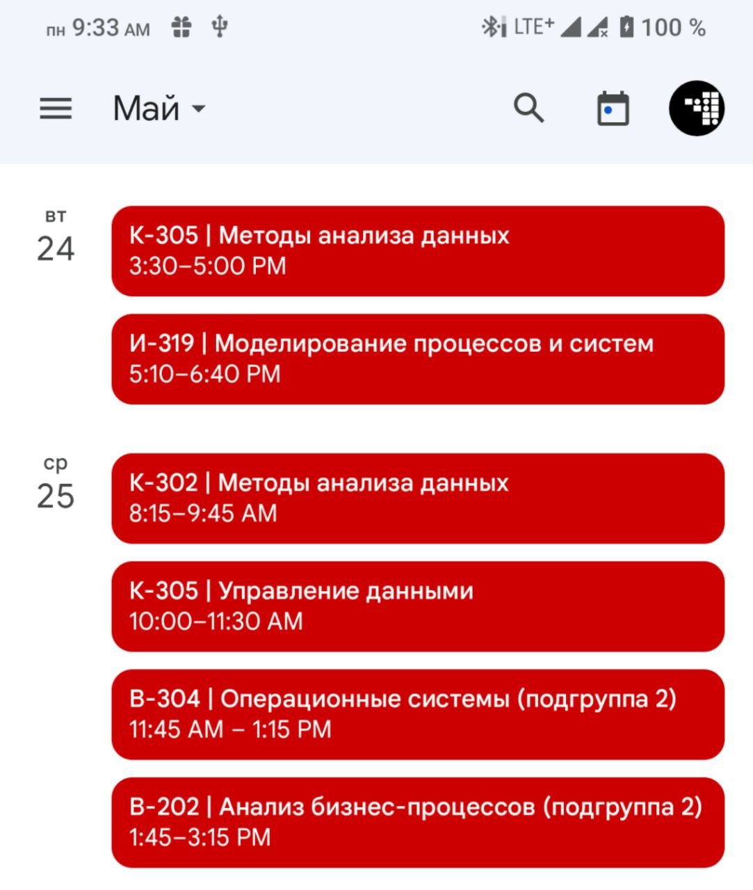

# Автоаукцион (Qt5/C++, курсовая 2-ого семестра)

Программа «Автоаукцион» работает с файлом, содержащим сведения: производитель автомобиля, модель, год выпуска, цвет, пробег, начальная цена. Список выводится в таблице, предоставляется возможность сортировки по любому сведению, поиск, а также вывод средней стоимости автомобиля одной модели в зависимости от года выпуска в виде диаграммы. Можно добавлять, изменять и удалять автомобили, создавать полный бекап или выборку данных в другой файл, работать с этими файлами данных. Файл с автомобилями и руководство пользователя загружаются из файлов `cars.data` и `readme.txt` в папке с исполняемым файлом.

Не забудьте изменить данные на свои в конце файлов `crswrk.pro` (строки 41-44) и `mainwindow.cpp` (строка 385).

